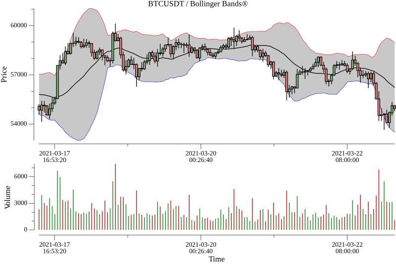

# FTA

Financial technical indicators implemented in Go.

Port of Python library [peerchemist/finta](https://github.com/peerchemist/finta)

## Drawing plots

Compatable with gonum's plot interfaces. You can check these plotters:

* [gonum/plot](https://github.com/gonum/plot)
* [go-hep/hep](https://github.com/go-hep/hep/tree/main/hplot)
* [pplcc/plotext](https://github.com/pplcc/plotext)

## Implemented indicators

* **SMA** (Simple moving average)
* **SMM** (Simple moving median)
* **SSMA** (Smoothed simple moving average)
* **EMA** (Exponential Weighted Moving Average)
* **WMA** (Weighted moving average)
* **HMA** (Hull Moving Average)
* **ROC** (The Rate-of-Change)
* **KST** (Know Sure Thing)
* **FISH** (Fisher Transform)
* **MACD** (Moving Average Convergence Divergence)
* **BBANDS** (Bollinger Bands)
* **PercentB** (Percent B)
* **RSI** (Relative Strength Index)
* **CRSI** (Connors RSI)
* **STOCH** (Stochastic Oscillator %K)
* **STOCHD** (Stochastic Oscillator %D)
* **StochRSI** (Stochastic RSI)
* **ADL** (Accumulation/Distribution Line)
* **CHAIKIN** (Chaikin Oscillator)
* **VZO** (Volume Zone Oscillator)
